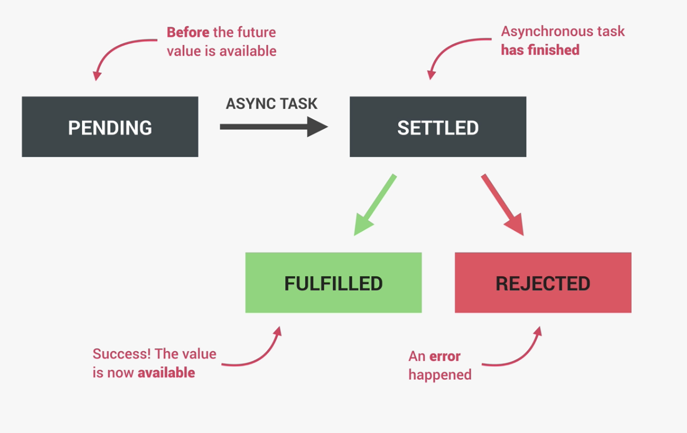
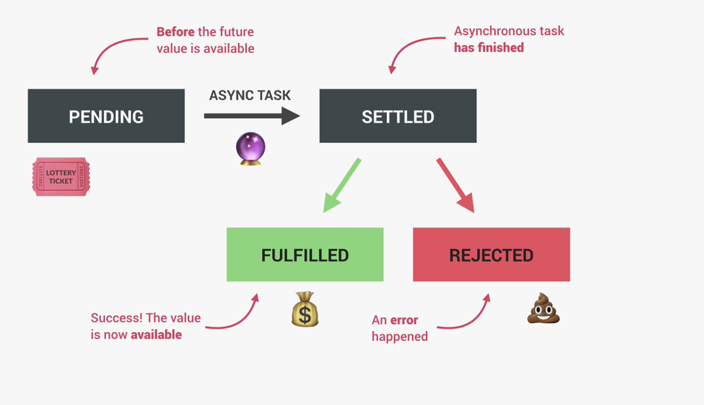
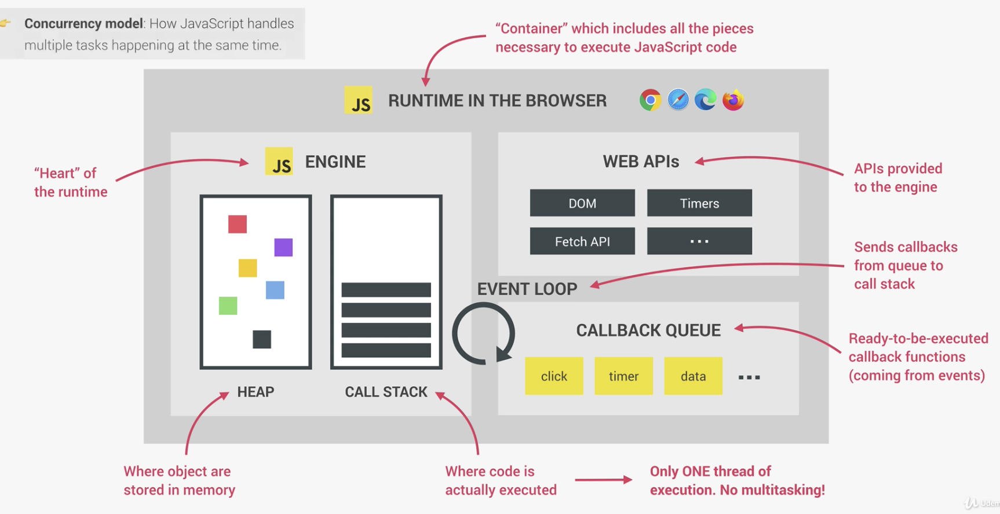
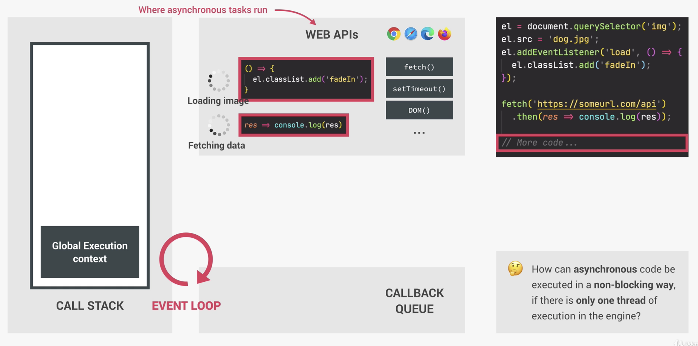
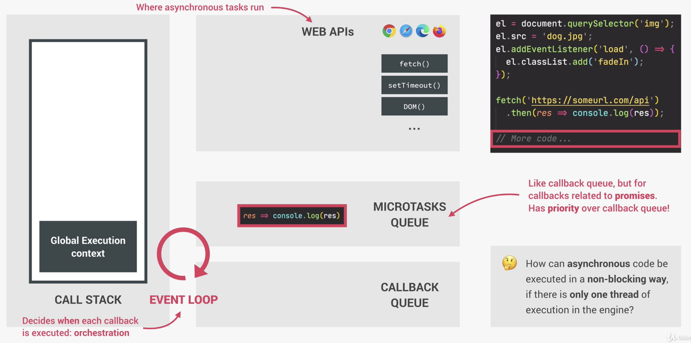

# Synchronous and Asynchronous code

### Synchronous code

Executed line by line in the sequence it is written.

Each line of code waits for previous line to finish.

Long running operations block code execution.

```javascript
var name = "charu";
alert("Name print block");
console.log(name);
```

### Asynchronous code

Asynchronous code is executed after a task that runs in the background finishes

Asynchronouse is non-blocking

Execution doesn't wait for asynchronus task to finish it's work

```javascript
var name = "charu";
setTimeout(() => {
  alert("Name print block");
}, 1000);
console.log(name);
```

setTimeout trigger asynchronous behavior and callback will be executed after 1 sec

Notes: Callback doesn't automatically make code asynchronous
for example

```javascript
[1, 2, 3].map((v) => v * 2);
```

Example: Asynchronous image loading with event and callback

```javascript
const img = document.querySelector(".dog");
img.src = "dog.jpg";
img.addEventListener("load", () => {
  // do something
});
```

when img.src line is executed, image started loading background. Once loaded, callback is executed.
Hence addEventListener doesn't automatically make code asynchronous.

# What is AJAX? and how does it make code asynchronous?

Asynchronous Javacript and XML

Allows us to communicate with remote web servers in an asynchronous way. The client (browser) can still work while the request is waiting for a response. When the server returns the response, a callback runs to handle it.

Server exposes API.
Client call servers APIs and gets / generates dynamic data

API stands for Application Programming interface.
Piece of software that can be used by another piece of sofware, in order to allow applications to talk to each other

# First API call using https node module

Get country details using `https://restcountries.eu/rest/v2/name/${country}` API

```javascript
const https = require("https");

function getCountryData(country) {
  https
    .get(`https://restcountries.eu/rest/v2/name/${country}`, (resp) => {
      let data = "";

      // A chunk of data has been received.
      resp.on("data", (chunk) => {
        data += chunk;
      });

      // The whole response has been received. Print out the result.
      resp.on("end", () => {
        console.log(`<--------${country}: START-------->`);
        console.log(JSON.parse(data));
        console.log(`<---------${country}: END--------->`);
      });
    })
    .on("error", (err) => {
      console.log("Error: " + err.message);
    });
}

getCountryData("portugal");
getCountryData("usa");
getCountryData("germany");
```

**Observation**: Sometimes USA comes first, sometimes Portugal and sometimes Germany.

Hence shows that http API call is non-blocking. getCountryData function get's called for USA even though we haven't received response for Portugal.

# Nested Callback

We didn't have control which will execute first. Hence we will do chaining of request.
When first call is completed, only then start second.

Get country and it's neighbours

```javascript
const https = require("https");

const getCountryAndNeighbour = function (country) {
  https
    .get(`https://restcountries.eu/rest/v2/name/${country}`, (resp) => {
      let data = "";

      // A chunk of data has been received.
      resp.on("data", (chunk) => {
        data += chunk;
      });

      // The whole response has been received. Print out the result.
      resp.on("end", () => {
        const parsedData = JSON.parse(data);
        console.log(`<--------${country} country: START-------->`);
        console.log(parsedData);
        console.log(`<---------${country} country: END--------->`);

        // Get neighbour country 2
        const [neighbour] = parsedData[0].borders;
        if (!neighbour) return;

        https.get(
          `https://restcountries.eu/rest/v2/alpha/${neighbour}`,
          (resp) => {
            let data = "";

            // A chunk of data has been received.
            resp.on("data", (chunk) => {
              data += chunk;
            });

            resp.on("end", () => {
              console.log(`<--------${country} neighbour: START-------->`);
              console.log(JSON.parse(data));
              console.log(`<---------${country} neighbour: END--------->`);
            });
          }
        );
      });
    })
    .on("error", (err) => {
      console.log("Error: " + err.message);
    });
};

getCountryAndNeighbour("portugal");
```

**Callback hell => lot of nested callback**

it's not just with HTTP apis but also with normal setTimeout

```javascript
setTimeout(() => {
  console.log("1 second passed");
  setTimeout(() => {
    console.log("2 second passed");
    setTimeout(() => {
      console.log("3 second passed");
      setTimeout(() => {
        console.log("4 second passed");
      }, 1000);
    }, 1000);
  }, 1000);
}, 1000);
```

# Promises and promises chaining

Modern way of API calling

### What is promise?

An object that is used a placeholder for the future result of an asynchronous operation

OR

it's a container for asynchronously delivered value

OR

it's a container for a future value

**Example**:
Lottery ticket: Promise that I will receive money if I guessed correct outcome

I buy lottery ticket => lottery draw happens asynchronously => if correct outcome, i receive money because it was promised

### Advantage of promise:

1. No need to rely on events and callbacks passed into asynchronous functions to handle asynchronous results.

2. Instead of nesting callbacks, we can chain promises for a sequence of asynchronous operations escaping callback hell


### Promisify HTTP API

```javascript
function httpRequest(url) {
  return new Promise(function (resolve, reject) {
    https
      .get(url, (resp) => {
        let data = "";

        // A chunk of data has been received.
        resp.on("data", (chunk) => {
          data += chunk;
        });

        // The whole response has been received. Print out the result.
        resp.on("end", () => {
          resolve(JSON.parse(data));
        });
      })
      .on("error", (err) => {
        console.log("Error: " + err.message);
        reject(err);
      });
  });
}
```

### Implement HTTP API call using fetch

### Promise Lifecycle

1. pending: before the future value is available
2. settled: asynchronous task is settled
   a. fulfilled
   b. rejected





First you build and then consume promise.
Build is done by fetch. Fetch return promise. Here you only need to consume promise

# Asynchronous in BE







example to show that promises are executed faster than callback

```javascript
console.log("Test start");
setTimeout(() => {
  console.log("0 sec time");
}, 0);
Promise.resolve("Resolved promise 1").then((res) => console.log(res));

Promise.resolve("Resolved promise 2").then((res) => {
  for (i = 0; i < 1000000; i++) {}
  console.log(res);
});

console.log("Test end");
```

# Handling rejected promises

**Handling individual promise rejection**

```javascript
function onReject(error) {
  console.log(error.message);
}

Promise.reject(new Error("REJECTED!"))
.then(() => {}, onReject);
```

**Global error handling using catch block**
```javascript
function onReject(error) {
  console.log(error.message);
}

Promise.reject(new Error("REJECTED!"))
.then(() => {}).catch(onReject);
```

Exercise: Do error handling in HTTP APIs call.

# Throw error

Throwing error when 404, 500. And creating helper function for that.

# Build your promise

```javascript
const lotteryPromise = new Promise(function (resolve, reject) {
  if (Math.random() >= 0.5) {
    resolve("You won lottery");
  } else {
    reject("You lost your money");
  }
});

lotteryPromise
  .then((res) => console.log(res))
  .catch((err) => console.error(err));
```

promisifying setTimeout

```javascript
const wait = function (seconds) {
  return new Promise((resolve) => setTimeout(resolve, seconds * 1000));
};

wait(1)
  .then(() => {
    console.log("1 second passed");
    return wait(1);
  })
  .then(() => console.log("2 second passed"));
```

# Consuming promise with Async await

```javascript
const whereAmI = async function (country) {
  const res = await fetch(`https://restcountries.eu/rest/v2/name/${country}`);
  console.log(res);
};
whereAmI("portugal");
console.log("testing async await");
```

# Error handling with try catch
